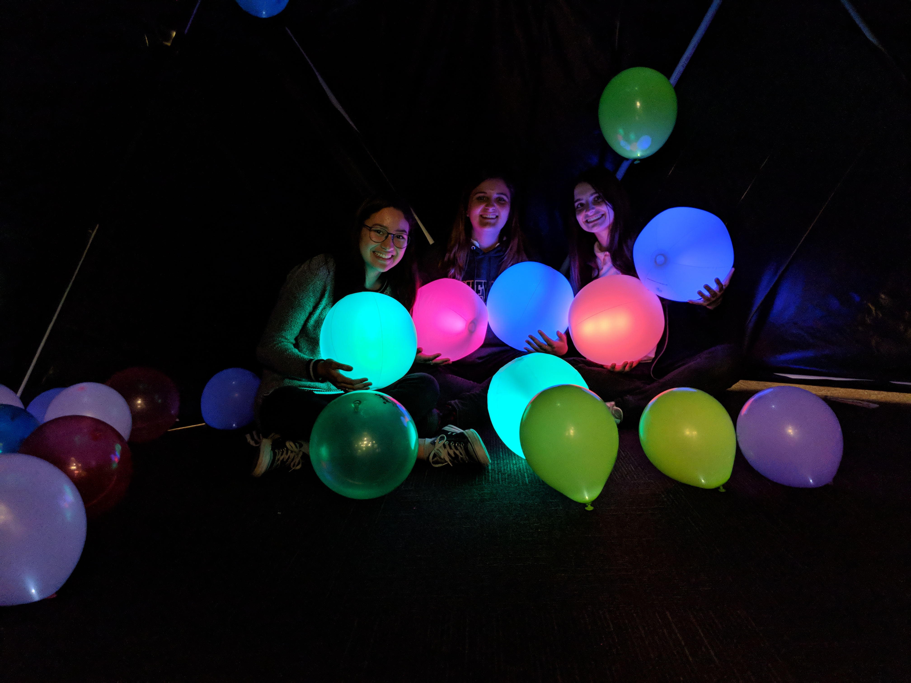
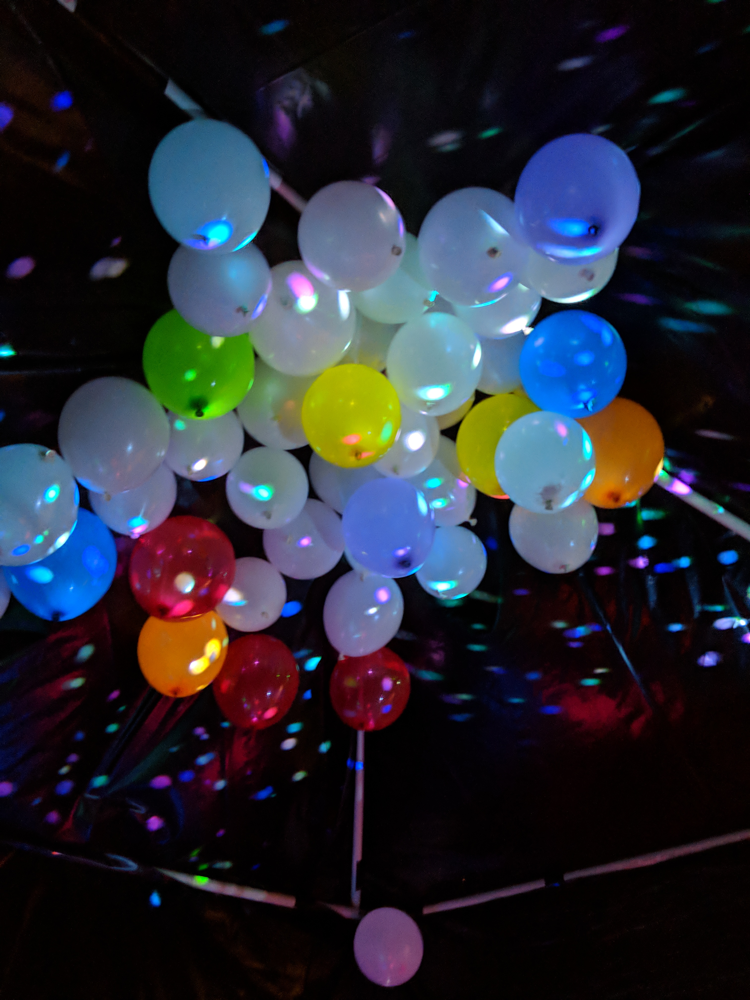

# Kromma

This project was made for an art installation for our Computer Science Projects Honors/Art and Technology Class. The installation consisted of inflatable, light-up beach balls that changed color according to acceleration contained within a dark, geodesic dome. In addition, within the dome, there were live animations that responded to sound/music being produced.

## Materials
* 1x Adafruit Feather 32u4 Basic Proto or 328p
* 1x LIS3DH 3-Axis Accelerometer
* 6x Adafruit RGB Smart Neopixels v2

## Updates
* 2/10/18
  * Neopixels can be programmed individually; accelerometer data prints in console, but the values don't change (so the data isn't helpful and probably is wrong)
* 3/8/18
  * Neopixels change color when accelerometer detects motion
* 4/20/18
  * Lights now change in a gradient instead of preset values
  * Added multiple color options

## Pictures
All six beach balls with the KROMMA team!

Action shot of beach ball

Additional elements of the installation

Model dome

Constructing the dome

## Authors

* **Emma Price**
* **Olivia Hockley-Rodes**
* **Kristen Cooney**

## Acknowledgments

* Dr Kessner for his patience in teaching us how to program Arduinos and solder
* Pinterest for giving us many ridiculous ideas
* Marlborough STEM department for giving us the money to build this art installation
